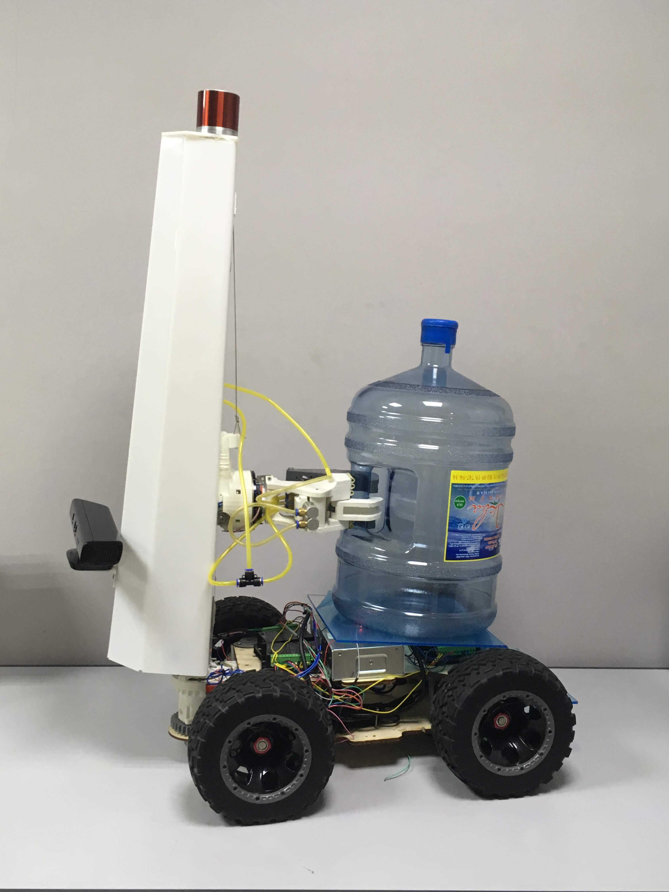

# Struct:
- Detection folder
- Drawing folder + arduino parser
- Other not interesting folders/files
- main.py
- BasicFunctions.py


### Detection folder
  There are all files which can detect anything
  
### Drawing folder
  Here is only one normal file, ParseArduino.py. Here you can set all arduino port names
  
### main.py
  It's main file for the project. Here you can set a model of an action. 
  In the variable with name "plan" you can configure the model. Just put there a list of commands in string format and separate it with "|"
  Here's a list of possible commands:
  - ```objects()``` **--> draw all detected objects**
  - ```marker()```  **--> draw ArUco markers**
  - ```qrcode()```  **--> draw qrcode markers**
  - ```bottles()``` **--> draw bottles only**
  - ```colors()```  **--> coming soon**

### BasicFunctions.py
  There are lots of custom function and nothing interesting.

# Examples

### Example #1 ###

  **Task #1:**
      You have to detect and follow an ArUco marker.
      
  **Solve:**
  1) Put the following code to *Detection/MarkerDetection.py*  after the 42th line
  ``` python
  if calibrateByMarker and ids[0][0] == goalMarker and ft: #check if detected marker looks like a goal marker; "ft" make it only one time
            cv2.drawContours(frame,[np.int0(rect)],-1,(0,0,255),3)
            mov = "gt("+str(angle) + ", " + str(dist+250) + ")" #"f(" + str(dist-200) + ")" #generate command for arduino
            evl(mov) #send command to arduino
            ft = False;
  ```
  2) Set variable ```plane``` in *main.py* to ```marker()```
  
  ---
  
  
  **Task #2:**
      You have to detect and follow a bottle.
      
  **Solve:**
  1) Put the following code to *Detection/ObjectDetection.py*  after the 42th line
  ``` python
	eval('gt(' + str(angle) + ', ' + str(int(dist)-350) + ')') #jast generate and send command to the Arduino (angle and dist are already calculated)
  ```
  2) Set variable ```plane``` in *main.py* to ```buttle()```
  
  ---
  
   **Task #3**
      You have to detect and follow a person.
      
  **Solve:**
  1) Put the following code to *Detection/ObjectDetection.py*  after the 85th line
  ``` python
	eval('gt(' + str(angle) + ', ' + str(int(dist)-350) + ')') #jast generate and send command to the Arduino (angle and dist are already calculated)
  ```
  2) Set variable ```plane``` in *main.py* to ```objects()```
  3) In *main.py* replace 
  ``` python
	drawObjects(globalName, frame, filter="all", return_bottle_imgs = True)
  ```
   by 
   ``` python
	drawObjects(globalName, frame, filter="person", return_bottle_imgs = True)
  ```
  4) You also can detect any kind of objects from list with name ```CLASSES``` in *Detect/ObjectDetection.py*. Just replace parametr ```filter``` (see section 3) to a string from ```CLASSES``` list
  
  
  
  
